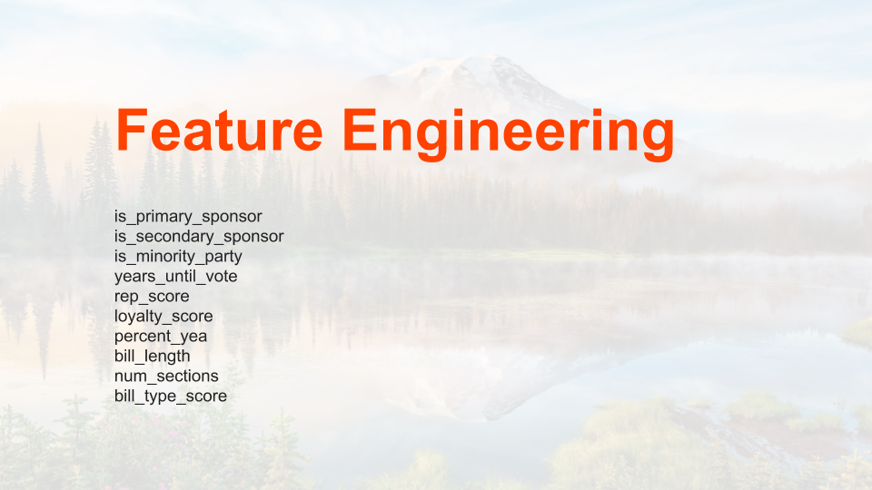
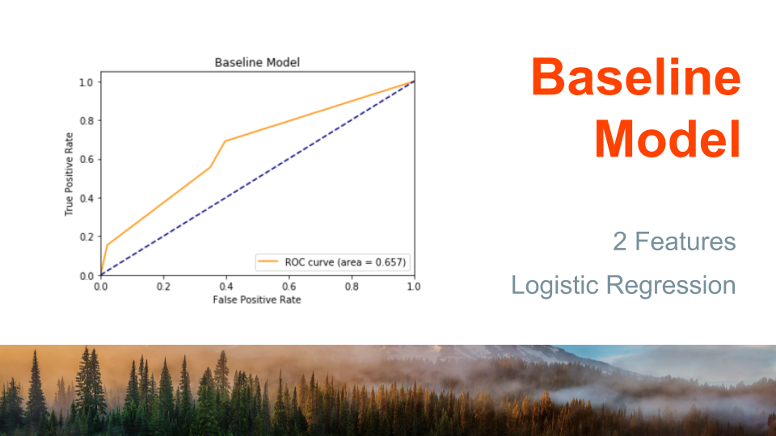
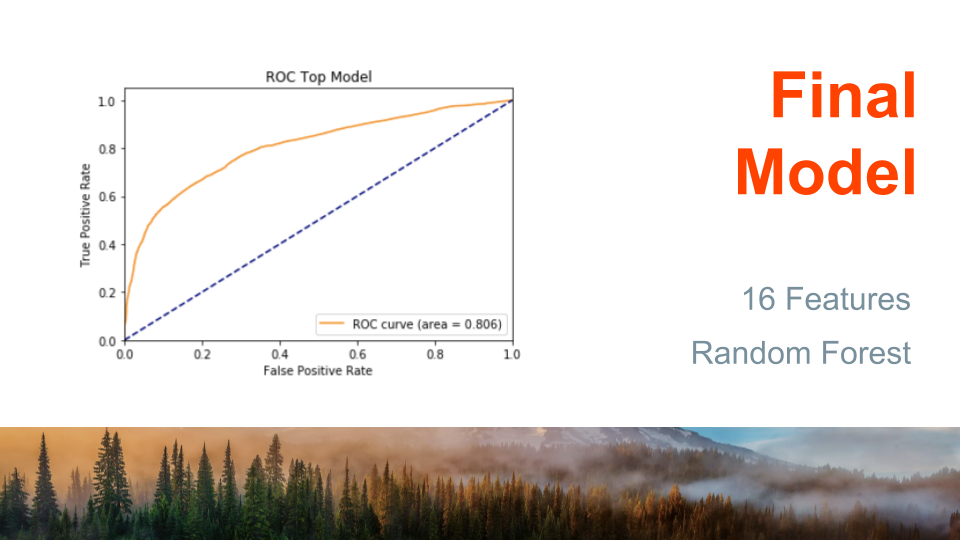

## Summary
Inside the Vote is a tool with the purpose of increasing transparency and accessibility of the Washington State Legislature. Using machine learning and statistical simulations I predict the probability that current State Senators and Representatives will vote "yea" on upcoming bills, and the probability that the bills will pass. Technologies used include Python, PostgreSQL, Selenium, Beautiful Soup and Amazon Web Services. 

## Website
The model is deployed [here](insidethevote.com)

## File Structure Summary
Directory | Description
------------ | -------------
data | example data used in this project
images | EDA and README figures
web | html, css, fonts, js, plugins for website
modeling | final model files
data_aquisition | web scraping and API functions
data_cleaning | data cleaning pipelines

## Business Question

Let's face it: local government is impossible to follow. Washington State Congress introduced over **1400** bills and passed **685** of them **in just the last year**. It's a full time job to keep up! You have to be updated on the party structure, current senators and representatives, district trends, current and past legislation and industry-specific knowlegde to even begin to make heads and tails of the new proposed bills. On top of that, bills are full of legalese and government jargon, making them inaccessibe to the average citizen. 

This tool will open the door for the everyday citizen to follow and weigh in on what's happening right here in Washington. A quick glance at the break down of sponsors and projected votes will equip Washingtonians to make their voice count.

## Data Collection and Understanding

### Data Collection

 - Washington State Legislative Web Services provided the bulk of the data used in this project. Data from this API included:
  * bill features (name, type, dates, urls to text)
  * bill status
  * bill sponsors (primary, secondary)
  * current and past legislators (id, party, name, district)
- Other data was scraped from the following website:
 * http://apps.leg.wa.gov/billsbytopic/default.aspx?year=2019 provided topic labels for each bill
 * The API provided a url for each bill. These were scraped to obtain the bill text.
- A few tables were created manually by me:
 * There were missing legislators from the API. I filled these in manually using this report: http://leg.wa.gov/History/Legislative/Documents/MembersOfLeg2018.pdf
 * I manually grouped the 1700 bill topics in to ~370 major categories
 * I created a table to record which party was in the minority each year

### Data Understanding
- 100,000 bills were used, dating back to 1991
- Voting history existed for roughly 20,000 bills since 1991
- WA State legislation operates in bienniums (two year periods). An example is '1995-96'
- 90% of all votes in training data were "yea" which meant that the model needed to identify which bills were likely to be controversial

## Modeling

### Train-test split:
- Bills with vote dates before 2018 were using for training, bills with vote dates in 2018 were used as the test set.

### Feature Engineering

#### Engineered Features: In Final Model
- is_primary_sponsor
- is_secondary_sponsor
- primary_sponsor_party
- rep_score: percentage of sponsors that are republican
- dem_score: percentage of sponsors that are democrats
- percent_yea: percentage that the senator or representative votes yea
- loyalty_score: score based on how often a senator or represenatitive votes with or against their party, weighted by the rep_score of the bill
- bill_length
- years_until_vote: number of years between the first reading and the final vote
- num_sections: how many sections are in the bill
- bill_type_score: the percentage of yea votes for each bill type (HB, SHB, SR, etc.)

#### Engineered Features: Explored but Discarded
- controversy_score
- Natural Language Processing on bill text
- Bill topic data

### Modeling
#### Evaluation Metrics
Log loss and ROC-AUC scores were used for evaluation.

The Baseline Model was trained with two features: primary_sponsor_party and party(voter's party). 
- Log loss: 0.408
- Roc-auc score: 0.679

The final model was a Random Forest Classifier with 1000 trees and a max_depth of 11. Gradient Boosting was also considered, but Random Forest performed the best.
- Log loss: 0.352
- Roc-auc score: 0.801

## Tools Used

